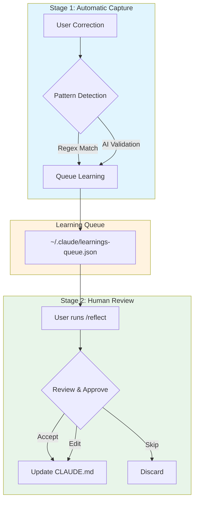
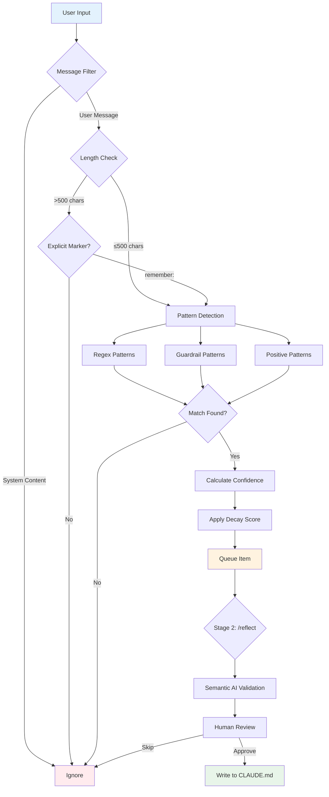
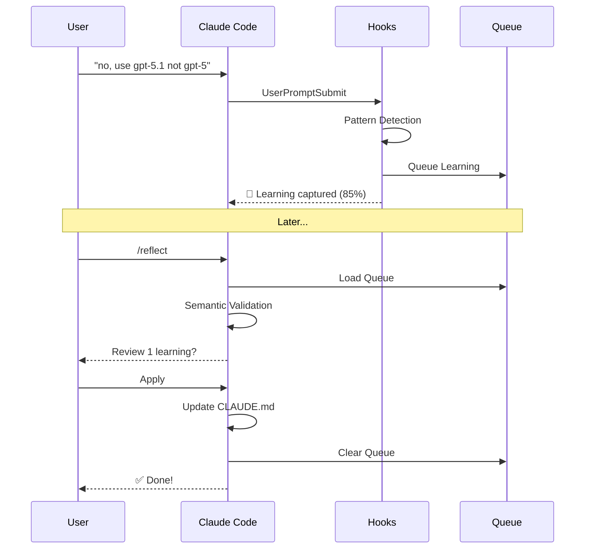

# claude-reflect

[](https://github.com/BayramAnnakov/claude-reflect/stargazers)
[](https://github.com/BayramAnnakov/claude-reflect/releases)
[](https://opensource.org/licenses/MIT)
[](https://github.com/BayramAnnakov/claude-reflect/actions)
[](https://github.com/BayramAnnakov/claude-reflect#platform-support)

> A self-learning system for Claude Code that captures corrections and discovers workflow patterns — turning them into permanent memory and reusable skills.

## Overview

**claude-reflect** implements a two-stage learning system that helps Claude Code remember your preferences and corrections across sessions:

1. **Capture Stage** (Automatic): Hooks detect correction patterns in real-time and queue them
2. **Process Stage** (Manual): You review and approve learnings before they're written to CLAUDE.md



## Key Features

- **Automatic Pattern Detection** — Captures corrections via hooks using regex patterns and AI validation
- **Multi-Language Support** — Understands corrections in any language, not just English
- **Confidence Scoring** — Each learning has a confidence score (0.60-0.95) based on pattern strength
- **Human-in-the-Loop** — You review all learnings before they're permanently stored
- **Historical Scanning** — Process past sessions to recover missed learnings
- **Skill Discovery** — AI-powered analysis finds repeating patterns that could become reusable `/commands`
- **Multi-Target Sync** — Updates CLAUDE.md, AGENTS.md (industry standard), and skill files
- **Semantic Deduplication** — Automatically consolidates similar entries
- **Cross-Platform** — Native support for macOS, Linux, and Windows (Python 3.6+)

## Architecture

### System Components

```mermaid
flowchart LR
    subgraph Hooks["Hook Layer"]
        H1[SessionStart]
        H2[UserPromptSubmit]
        H3[PreCompact]
        H4[PostToolUse]
    end
    
    subgraph Scripts["Processing Layer"]
        S1[capture_learning.py]
        S2[check_learnings.py]
        S3[post_commit_reminder.py]
        S4[session_start_reminder.py]
    end
    
    subgraph Lib["Core Library"]
        L1[reflect_utils.py]
        L2[semantic_detector.py]
    end
    
    subgraph Storage["Storage Layer"]
        Q["learnings-queue.json"]
        B["learnings-backups/"]
    end
    
    subgraph Commands["Command Layer"]
        C1[/reflect]
        C2[/reflect-skills]
        C3[/view-queue]
        C4[/skip-reflect]
    end
    
    subgraph Output["Output Targets"]
        O1[~/.claude/CLAUDE.md]
        O2[./CLAUDE.md]
        O3[./AGENTS.md]
        O4[.claude/commands/]
    end
    
    H2 --> S1
    H3 --> S2
    H4 --> S3
    H1 --> S4
    
    S1 --> L1
    S1 --> L2
    
    L1 --> Q
    L1 --> B
    
    Q --> C1
    Q --> C2
    
    C1 --> O1
    C1 --> O2
    C1 --> O3
    C1 --> O4
    
    style Hooks fill:#e3f2fd
    style Scripts fill:#f3e5f5
    style Lib fill:#fff3e0
    style Storage fill:#e8f5e9
    style Commands fill:#fce4ec
    style Output fill:#e0f2f1
```

### Detection Pipeline



## Tech Stack

| Component | Technology |
|-----------|------------|
| **Language** | Python 3.6+ |
| **Hooks** | Claude Code Plugin System (JSON-based) |
| **Pattern Matching** | Python Regex (`re` module) |
| **AI Validation** | Claude CLI (`claude -p`) |
| **Storage** | JSON files |
| **Testing** | pytest (160 tests) |
| **CI/CD** | GitHub Actions |
| **License** | MIT |

## Installation

### Prerequisites

- [Claude Code](https://claude.ai/code) CLI installed
- Python 3.6+ (included on most systems)

### Install via Plugin Marketplace

```bash
# Add the marketplace
claude plugin marketplace add bayramannakov/claude-reflect

# Install the plugin
claude plugin install claude-reflect@claude-reflect-marketplace

# IMPORTANT: Restart Claude Code to activate the plugin
```

> **Note:** After installation, **restart Claude Code** (exit and reopen) for hooks to auto-configure.

### Platform Support

| Platform | Status | Notes |
|----------|--------|-------|
| **macOS** | ✅ Fully Supported | Native Python |
| **Linux** | ✅ Fully Supported | Native Python |
| **Windows** | ✅ Fully Supported | Native Python, no WSL required |

## Usage

### Available Commands

| Command | Description |
|---------|-------------|
| `/reflect` | Process queued learnings with human review |
| `/reflect --scan-history` | Scan ALL past sessions for missed learnings |
| `/reflect --dry-run` | Preview changes without applying |
| `/reflect --targets` | Show detected config files (CLAUDE.md, AGENTS.md) |
| `/reflect --review` | Show queue with confidence scores and decay status |
| `/reflect --dedupe` | Find and consolidate similar entries in CLAUDE.md |
| `/reflect-skills` | Discover skill candidates from repeating patterns |
| `/reflect-skills --days 30` | Analyze last 30 days (default: 14) |
| `/reflect-skills --all-projects` | Scan all projects for cross-project patterns |
| `/skip-reflect` | Discard all queued learnings |
| `/view-queue` | View pending learnings without processing |

### Basic Workflow



### Example Interactions

**Automatic Capture:**
```
User: no, use gpt-5.1 not gpt-5 for reasoning tasks
Claude: Got it, I'll use gpt-5.1 for reasoning tasks.

[Hook captures this correction to queue]
📝 Learning captured: 'no, use gpt-5.1 not gpt-5...' (confidence: 85%)
```

**Processing with /reflect:**
```
User: /reflect
Claude: Found 1 learning queued:
       
       ┌─────────────────────────────────────────────────────────┐
       │ "Use gpt-5.1 for reasoning tasks"                       │
       │ Confidence: 0.85 | Pattern: no, use-X-not-Y            │
       └─────────────────────────────────────────────────────────┘
       
       Apply to ~/.claude/CLAUDE.md? [y/n/e]
```

**Skill Discovery:**
```
User: /reflect-skills
Claude: Found 2 potential skills from analyzing 68 sessions:

       1. /daily-review (High) — from my-productivity-tools
          → Review productivity using time tracking data
          Evidence: 15 similar requests
       
       2. /deploy-app (High) — from my-webapp
          → Deploy application with pre-flight checks
          Evidence: 10 similar requests
```

## Environment Variables

| Variable | Description | Default |
|----------|-------------|---------|
| `CLAUDE_REFLECT_REMINDER` | Disable session start reminders | `true` |

```bash
# Disable session start reminders
export CLAUDE_REFLECT_REMINDER=false
```

## Detection Patterns

### Correction Patterns (High Confidence)

| Pattern | Example | Confidence |
|---------|---------|------------|
| `no, use X` | "no, use Python not JS" | 0.70-0.85 |
| `don't use` | "don't use var, use let" | 0.70-0.85 |
| `remember:` | "remember: always test first" | 0.90 |
| `actually...` | "actually, I meant..." | 0.65-0.75 |
| `I told you` | "I already told you to..." | 0.85 |
| Guardrails | "don't refactor unless asked" | 0.85-0.90 |

### Positive Feedback Patterns

| Pattern | Example | Confidence |
|---------|---------|------------|
| `perfect!` | "Perfect! Exactly what I wanted" | 0.70 |
| `great approach` | "That's a great approach" | 0.70 |
| `nailed it` | "You nailed it" | 0.70 |

## File Structure

```
claude-reflect/
├── .claude-plugin/
│   └── plugin.json              # Plugin manifest
├── commands/
│   ├── reflect.md               # Main /reflect command
│   ├── reflect-skills.md        # Skill discovery
│   ├── skip-reflect.md          # Discard queue
│   └── view-queue.md            # View pending learnings
├── hooks/
│   └── hooks.json               # Hook definitions
├── scripts/
│   ├── lib/
│   │   ├── reflect_utils.py     # Shared utilities
│   │   └── semantic_detector.py # AI-powered analysis
│   ├── capture_learning.py      # UserPromptSubmit hook
│   ├── check_learnings.py       # PreCompact hook
│   ├── post_commit_reminder.py  # PostToolUse hook
│   ├── session_start_reminder.py # SessionStart hook
│   └── ...                      # Additional utilities
├── tests/                       # Test suite (160 tests)
├── CHANGELOG.md                 # Version history
├── CLAUDE.md                    # Project context
├── DISTRIBUTION.md              # Distribution strategy
├── LICENSE                      # MIT License
├── README.md                    # This file
├── RELEASING.md                 # Release process
└── SKILL.md                     # Plugin context
```

## Multi-Target Sync

claude-reflect can sync learnings to multiple destinations:

```mermaid
flowchart LR
    A[/reflect] --> B{Route Learning}
    
    B -->|Global Pattern| C["~/.claude/CLAUDE.md"]
    B -->|Project-Specific| D["./CLAUDE.md"]
    B -->|Subdirectory| E["./**/CLAUDE.md"]
    B -->|Skill File| F[".claude/commands/*.md"]
    B -->|Industry Standard| G["./AGENTS.md"]
    
    style A fill:#e3f2fd
    style C fill:#e8f5e9
    style D fill:#e8f5e9
    style E fill:#e8f5e9
    style F fill:#fff3e0
    style G fill:#fce4ec
```

## Testing

Run the test suite:

```bash
# Install pytest if needed
pip install pytest

# Run all tests
python -m pytest tests/ -v

# Run specific test file
python -m pytest tests/test_reflect_utils.py -v
```

## Contributing

We welcome contributions! Please follow these guidelines:

1. **Fork the repository** and create your branch from `main`
2. **Run tests** before submitting PRs
3. **Update documentation** for any new features
4. **Follow existing code style** (PEP 8 for Python)
5. **Add tests** for new functionality

### Development Setup

```bash
# Clone the repository
git clone https://github.com/BayramAnnakov/claude-reflect.git
cd claude-reflect

# Test capture hook with simulated input
echo '{"prompt":"no, use gpt-5.1 not gpt-5"}' | python3 scripts/capture_learning.py

# View current learnings queue
cat ~/.claude/learnings-queue.json

# Clear queue for testing
echo "[]" > ~/.claude/learnings-queue.json
```

## Changelog

See [CHANGELOG.md](CHANGELOG.md) for version history and release notes.

## License

MIT License - see [LICENSE](LICENSE) for details.

Copyright (c) 2025 Bayram Annakov

## Acknowledgments

- Thanks to all contributors who have helped improve claude-reflect
- Special thanks to the Claude Code team for the plugin system
- Inspired by the need for persistent memory in AI-assisted development

---

**Made with ❤️ for the Claude Code community**
